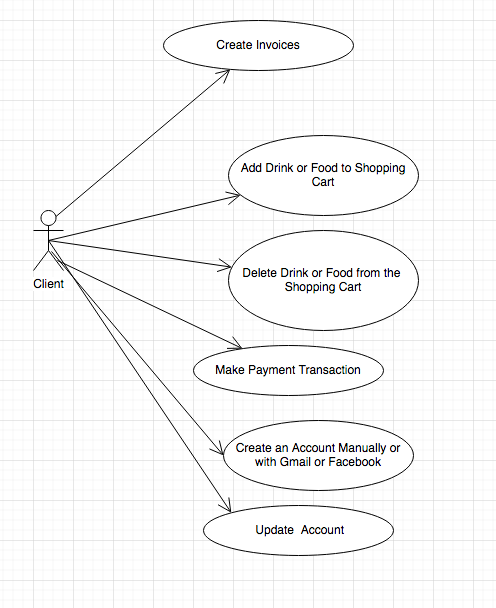
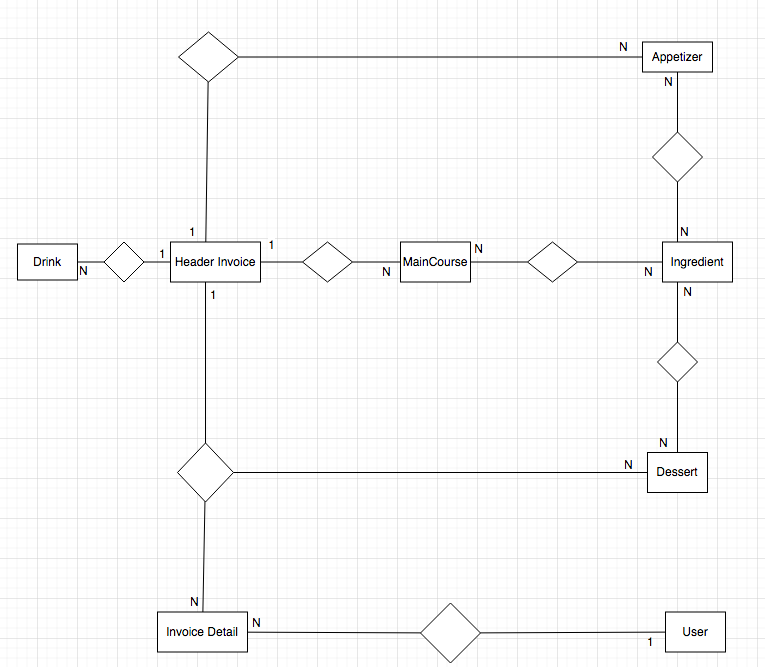
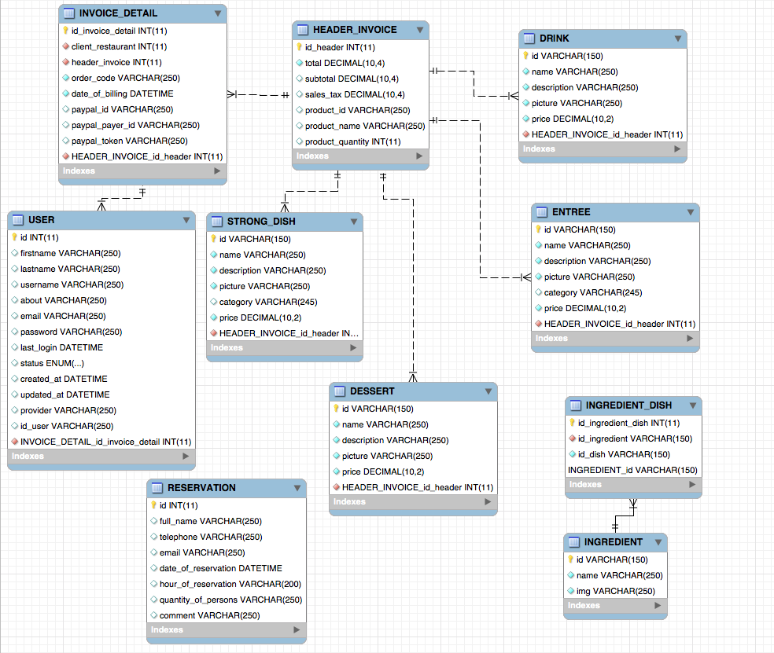

# server-nodejs-restaurant

This project require another project as Front-End [React Redux Shopping Cart](https://github.com/LeoCR/react-redux-shopping-cart-restaurant).

### Use Case Diagram

### Entity Relationship Model

### Entity Relationship Diagram 

Run: `npm run local`
Open [https://localhost:49652](https://localhost:49652) to view it in the browser
